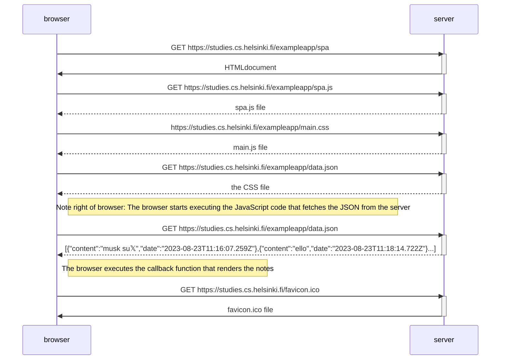

```mermaid
sequenceDiagram
participant browser
participant server

browser->>server: GET https://studies.cs.helsinki.fi/exampleapp/spa
activate server 
server->>browser: HTMLdocument
deactivate server

browser->>server: GET https://studies.cs.helsinki.fi/exampleapp/spa.js
activate server
server-->>browser: spa.js file
deactivate server

browser->>server: https://studies.cs.helsinki.fi/exampleapp/main.css
activate server
server-->>browser: main.js file
deactivate server


browser->>server: GET https://studies.cs.helsinki.fi/exampleapp/data.json
activate server
server-->>browser: the CSS file
deactivate server

Note right of browser: Note right of browser: The browser starts executing the JavaScript code that fetches the JSON from the server

browser->>server: GET https://studies.cs.helsinki.fi/exampleapp/data.json
activate server
server-->>browser: [{"content":"musk su𝕏","date":"2023-08-23T11:16:07.259Z"},{"content":"ello","date":"2023-08-23T11:18:14.722Z"}...]
deactivate server    

Note right of browser: The browser executes the callback function that renders the notes 

browser->>server: GET https://studies.cs.helsinki.fi/favicon.ico
activate server
server->>browser: favicon.ico file
deactivate server 
```