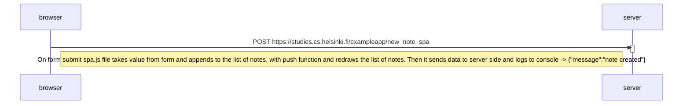

```mermaid
sequenceDiagram
participant browser
participant server

browser->>server: POST https://studies.cs.helsinki.fi/exampleapp/new_note_spa
activate server 
deactivate server


Note right of browser: On form submit spa.js file takes value from form and appends to the list of notes, with push function and redraws the list of notes. Then it sends data to server side and logs to console -> {"message":"note created"}


```